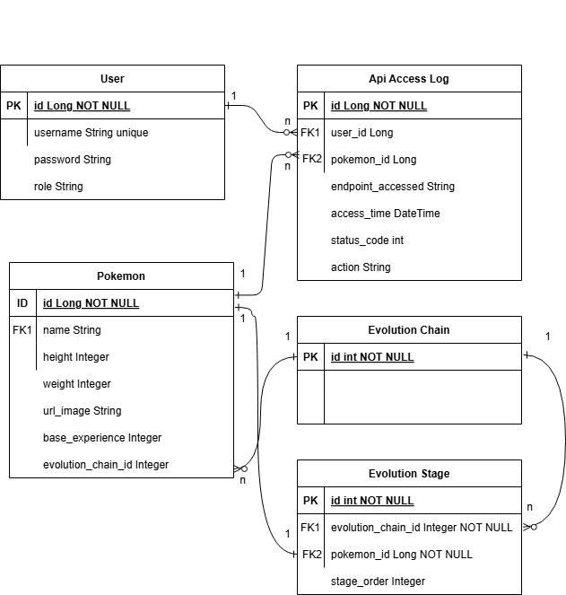

# 🧬 Poke-Dex Plus Backend

Welcome to the **Poke-Dex Plus** backend — an API built with Spring Boot that allows you to fetch information about new Pokémon from [PokeAPI](https://pokeapi.co/), register them in your own database, and manage user access with role-based permissions.

---

## 🚀 Features

- 🔍 Automatic fetch and registration of new Pokémon from PokeAPI.
- 🗃️ Local database with duplicate control.
- 🔐 JWT authentication.
- 👥 Role management: `TRAINER` and `ADMIN`.
- 📊 Access log available for administrators.
- 📑 Swagger documentation.
- ❤️ Health check using Spring Actuator.

---

## 🛠️ Technologies

- Java 21
- Spring Boot
- Spring Security
- JWT (JSON Web Tokens)
- MapStruct
- Lombok
- Swagger (springdoc-openapi)
- MySQL

---

## 🧩 Entity-Relationship Diagram



---

## 📚 Main Endpoints

### 🔐 Authentication
| Method | Path              | Description                      |
|--------|-------------------|----------------------------------|
| POST   | `/auth/login`     | Log in (returns JWT)             |
| POST   | `/auth/register`  | Register a new user              |

### 🧪 Pokédex
| Method | Path                              | Description                                   |
|--------|-----------------------------------|-----------------------------------------------|
| GET    | `/pokedex/{id}`                   | Get a Pokémon (remote fetch if not registered) |
| GET    | `/pokedex/without-evolution/{id}` | Get a Pokémon without evolution               |

### 🔐 Admin
| Method | Path               | Required Role |
|--------|--------------------|---------------|
| GET    | `/api/access-logs` | `ADMIN`       |

---

## 🩺 Health Check & Documentation

- Swagger UI: [http://localhost:8080/swagger-ui/index.html](http://localhost:8080/swagger-ui/index.html)
- Actuator Health: [http://localhost:8080/actuator/health](http://localhost:8080/actuator/health)

---

## ⚙️ Installation & Run

### Prerequisites

- JDK 21
- MySQL
- Gradle

### Environment Variables

Set your `application.properties` or `application.yml` with your database and JWT settings:

```properties
spring.datasource.url=jdbc:mysql://localhost:3306/pokedex
spring.datasource.username=your_user
spring.datasource.password=your_password

jwt.key=your_secret_key
